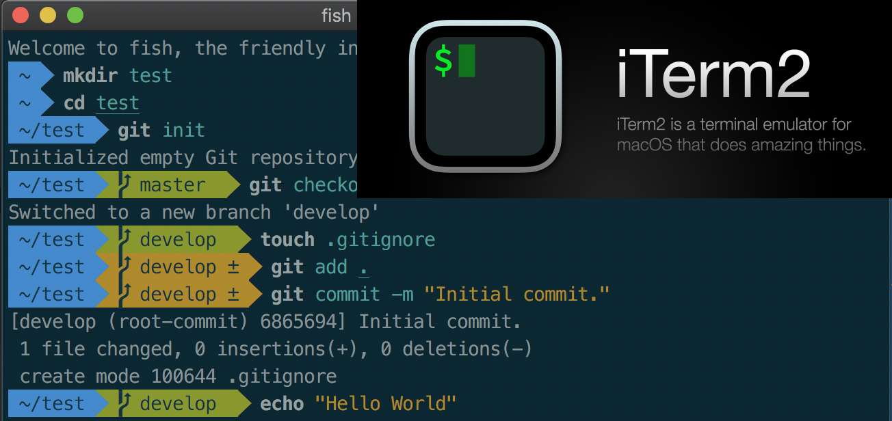
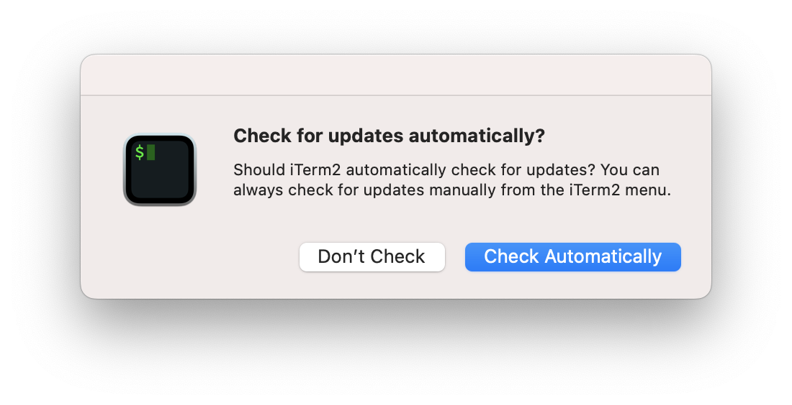
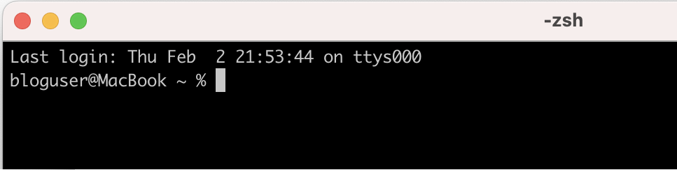
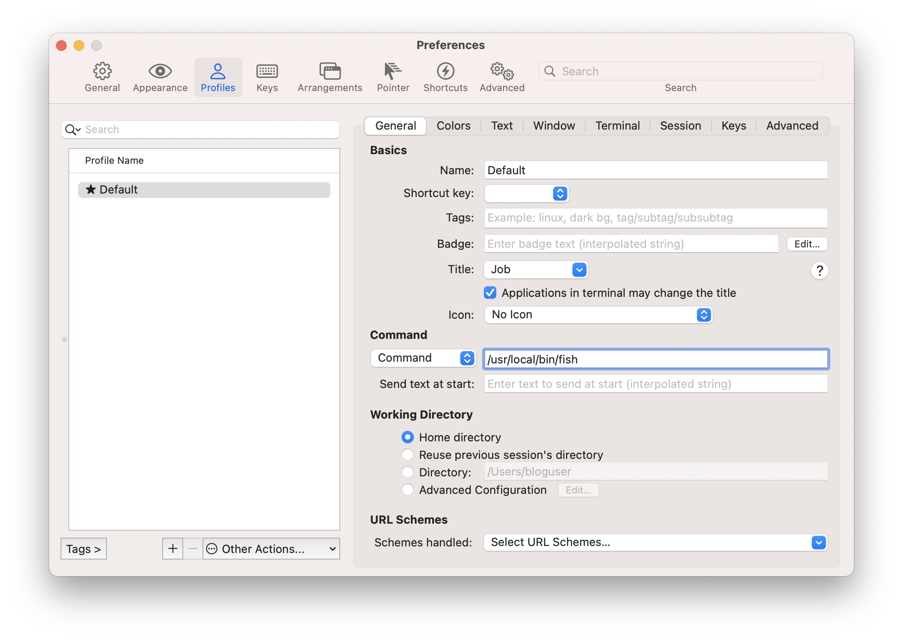
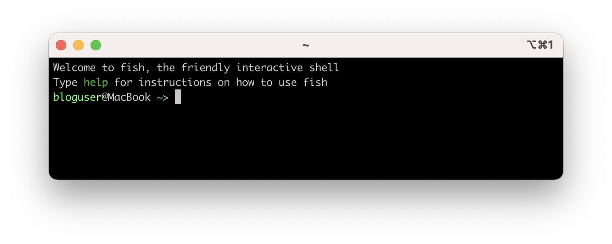
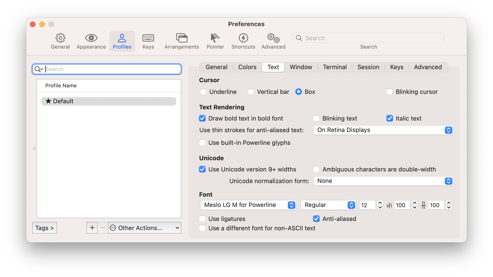
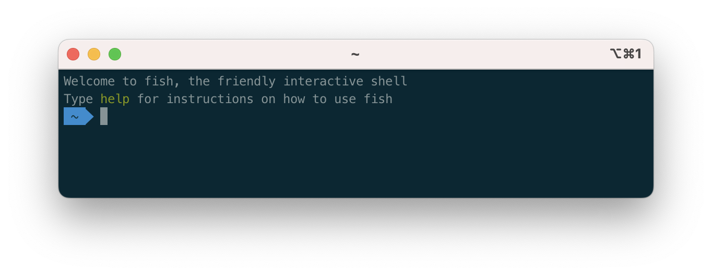
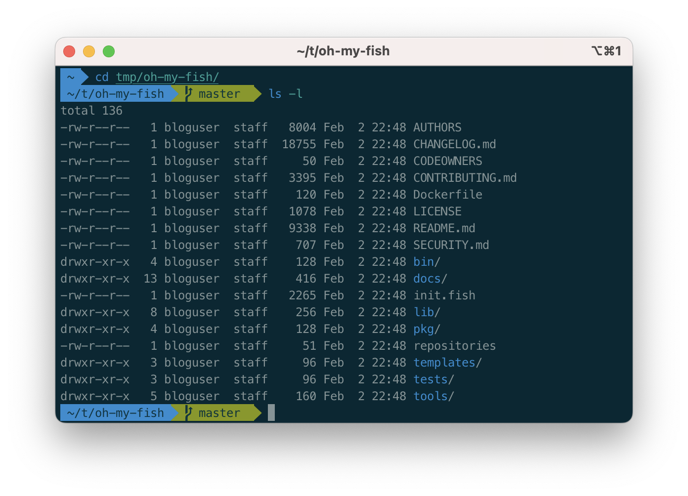

iTerm2 with Fish Shell
======================

Fish Shell with Solarized Theme
-------------------------------

**iTerm2** is a popular terminal emulator for macOS, designed to replace the built-in Terminal application. It offers features such as split panes, customizable profiles, triggers, search, paste history, and more. It is free, open source, and actively maintained by a community of developers.

For those who are familiar, iTerm2 is a superior option compared to the terminal application in Mac OS. This guide will walk you through the process of configuring iTerm2 for improved daily productivity by customizing its appearance with cool colors and clear fonts.

iTerm2 Installation
-------------------

Initially, obtain the iTerm2 application from its official website.

`https://iterm2.com/downloads.html <https://iterm2.com/downloads.html>`_

.. Note::
    It is advisable to use a stable version of iTerm2 for work or official purposes. At the time of writing this tutorial, 3.4.19 is the stable version. 

A simple zip file will be downloaded. Extract the contents and move the iTerm.app file to Application directory.

.. image:: ./../image/macos/iterm/1.png

You can launch the iTerm application using any of your favorite method now. At the first launch, it may prompt you for auto-update option. It’s highly recommended to enable the auto update by pressing “Check Automatically”

The iterm2 is ready to use now and below is the look of the iterm2 terminal window. It’s time to modify the look and feel. 

Homebrew Installation
---------------------

The below code will download and install the MacOS package manager **Homebrew** for the local user. It may prompt you for some information and warnings. The default answers should be good for most cases. 

.. code-block:: bash
    :linenos:

    /bin/bash -c "$(curl -fsSL https://raw.githubusercontent.com/Homebrew/install/HEAD/install.sh)"

Fish Shell Installation
-----------------------

Use the below command to install fish shell. 

.. code-block:: bash
    :linenos:
    
    brew install fish

Write the fish shell to system shells.

.. code-block:: bash
    :linenos:
    
    echo "/usr/local/bin/fish" | sudo tee -a /etc/shells

Open the iTerm2 profiles by iTerm2 > Settings > Profiles. If you want to use only fish shell, use the Default profile. Else, you can create a new profile as per your requirement. In my case, I'm using the Default profile. 

Under Command section drop-down, select "Command" and add the the below command. 

.. code-block:: bash
    :linenos:
    
    /usr/local/bin/fish

This will make the iTerm to start in fish shell at startup. 

Close the setting window and restart iTerm2 to apply the new changes. You can see the look has changed as below. 

Oh-my-fish Installation
-----------------------

Oh My Fish provides core infrastructure to allow you to install packages which extend or modify the look of your shell. More information can be found in `https://github.com/oh-my-fish/oh-my-fish <https://github.com/oh-my-fish/oh-my-fish>`_.

Run this command to install oh-my-fish.

.. code-block:: bash
    :linenos:
    
    curl https://raw.githubusercontent.com/oh-my-fish/oh-my-fish/master/bin/install | install

If your fish installation was not sucessful, you may have issues running this command in iTerm2 since this is a fish shell. please use the default Terminal application and save the script using below command. This will download and save the script to a file ``/tmp/install``

.. code-block:: bash
    :linenos:
    
    cd /tmp
    curl https://raw.githubusercontent.com/oh-my-fish/oh-my-fish/master/bin/install > install

Once the file is saved, run below commands to add execution permission and run it. 

.. code-block:: bash
    :linenos:
    
    chmod +x install
    ./install

Restart the iTerm2, notice the prompt has changed as below.

oh-my-fish agnoster package Installation
----------------------------------------

Agnoster is a fish theme optimized for people who use **Git** kind of commands regularly. More information can be found in `https://github.com/oh-my-fish/oh-my-fish/blob/master/docs/Themes.md#agnoster <https://github.com/oh-my-fish/oh-my-fish/blob/master/docs/Themes.md#agnoster>`_.

Use the below command to install the theme

.. code-block:: bash
    :linenos:
    
    omf install agnoster

Powerline Font Installation
---------------------------

These fonts are pathed to adjust all symbolic outputs of fish and all related themes. Run the below commands to install the fonts to current user's fonts directory.

.. code-block:: bash
    :linenos:

    git clone https://github.com/powerline/fonts.git --depth=1
    cd fonts
    ./install.sh
    cd ..
    rm -rf fonts

Now, open the iTerm2 profile again, switch to Text section and change the font to **"Meslo LG M for Powerline"**. If needed, adjust the font sizes. 

Restart the iTerm and notice the change in iTerm2 prompt. 

Solarized Color Installation
----------------------------

As of this point, the intended look appeared but the colors are not comfortable. Please install the "Solarized Dark - Patched" color scheme to get the best colors in iTerm window and fonts. 

Save as this link in your local Downloads :download:`Solarized Dark Patched Color Preset <./../file/macos/iterm/solarizeddarkpatched.itermcolors>`.

Double click and import the color scheme

Open the iTerm2 profile again, switch to Colors section. 

Under "Color Presets" drop down menu, chose "Solarized Dark - Patched"

Restart the iTerm and notice the change in iTerm2 prompt as below. This is our final look we are intended. 

Issues and Fixes
----------------

Once I have completed this documentation, I have received some feedback from colleagues and friends. Below are some issues faced and solutions. 

1. Fish shell by default shorten the directory location at your prompt. If your working directory is too long, you will see only first letters of parent directories. You can simply fix this to make full directory visible by adding below line to ``~/.config/fish/config.fish``

.. code-block:: bash
    :linenos:

    set -g fish_prompt_pwd_dir_length 0

1.  At the installation section above, you can change the default profile by adding a command ``/usr/local/bin/fish``. By doing this, some users complained about a bug where many familiar commands are throwing an error ``Command not found``. 

You can easily by pass this by completely switching to fish shell at login using this command. 

.. code-block:: 
    :linenos:

    chsh -s /usr/local/bin/fish 

Now, you can go back to iTerm2 > Settings > Profiles > Default and change the command to ``login``.

.. note:: 

    Please keep in mind that this command is changing your default shell hence all your terminal applications including default MacOS terminal will switch to fish shell. 
