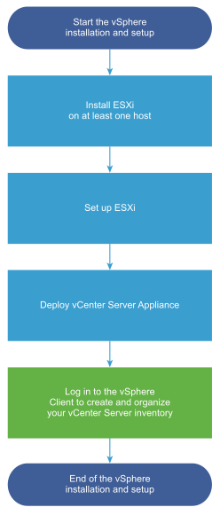

VMware vCenter - Step-by-step 
=============================

VMware vCenter is an advanced server management software that provides a centralized platform for controlling vSphere environments for visibility across hybrid clouds.

More details can be found in  `VMware official website <https://www.vmware.com/products/vcenter.html>`_. 

Overview
--------

vSphere is a sophisticated product with multiple components to install and set up. To ensure a successful vSphere deployment, understand the sequence of tasks required.

Installing vSphere includes the following tasks:

You can deploy the vCenter Server appliance on an ESXi host or vCenter Server instance. In this guide, we are deploying vCenter server appliance on an **ESXi host** which is already deployed. 

You can use the GUI method to deploy the appliance interactively. Alternatively, you can use the CLI method to perform a silent deployment of the appliance. In this guide, we are deploying vCenter server appliance using **GUI method**. 

Prerequisites
-------------

Below is the summary of required resources to start the installation. You can find the detailed system Requirements for the vCenter Server Appliance from `official guide <https://docs.vmware.com/en/VMware-vSphere/7.0/com.vmware.vcenter.install.doc/GUID-752FCA83-1A9B-499E-9C65-D5625351C0B5.html>`_.

* Deployment client machine 
    * Windows 32-bit or 64-bit
    * MacOS
* ESXi host 6.5 or later
    * CPU (min 2 vCPUs)
    * Memory (min 12GB)
    * Disk space (min 579GB)
* Same DNS server configured for ESXi host and deployment machine. This is optional if you are using IP address only. 
* Synchronize the clocks of the target server(s).
* Required firewall ports should be opened (if equiped)
* Supported web browser to access vCenter client

With all prerequisites, download the required version of vCenter ISO file from official vmware download center. In this guide, I'm using VMware vCenter Server 7.0U3.

`https://customerconnect.vmware.com/downloads/get-download?downloadGroup=VC70U3 <https://customerconnect.vmware.com/downloads/get-download?downloadGroup=VC70U3>`_

Installation
------------

1. Mount the ISO file and navigate to DVD-Drive > vcsa-ui-installer > win32. Launch the `installer.exe`. Since this is first time, chose `Install`. 

.. image:: ./../image/vmware/vcenter/1.png

2. Start the Stage 1 - Deploy vCenter Server. 

3. Accept the terms and continue. 

.. image:: ./../image/vmware/vcenter/3.png

4. Enter the DNS name or IP address of the ESXi host where you want to deploy the vCenter server. Additionally, enter the username and password of ESXi.  

.. image:: ./../image/vmware/vcenter/4.png

5. Specify the VM name for the vCenter and root password for the appliance. 

.. image:: ./../image/vmware/vcenter/5.png

6. Select the deployement size and storage size. You can customize this as per your requirement with the given chart. 

.. image:: ./../image/vmware/vcenter/6.png

7. Select the datastore for the appliance and optionally you can chose to `Thin Disk mode` to save space. 

.. image:: ./../image/vmware/vcenter/7.png

8. Configure the network settings of the appliance as per your network design. 

9. You can confirm the settings at summary page and continue the deployment. This will take some time to complete. 

.. image:: ./../image/vmware/vcenter/9.png

10. You can continue the configuration using the given continue button or with the given link. ``https://vcenter-ip-or-DNS-name:5480``

.. image:: ./../image/vmware/vcenter/10.png

11. Now, you can start the Stage 2, Set up vCenter Server. 

.. image:: ./../image/vmware/vcenter/11.png

12. Synchronize time with your NTP servers and continue. You can enter multiple servers with comma seperated. 

13. Create a new SSO domain, enter domain name, username and password to continue. If you have an existing domain, you can join there also. 

.. image:: ./../image/vmware/vcenter/13.png

14. If you wish, you can join the Vmware customer experience improvement program (CEIP). 

15. Confirm your settings at summary page once again and start the setup deployement. You will get a warning saying "You cannot go back".

16. Once the setup is completed, you can access the vCenter client by accessing ``https://vcenter-ip-or-DNS-name:443``

.. image:: ./../image/vmware/vcenter/17.png

17. You can launch the HTML5 vSphere Client and login using the SSO credentials created during the deployment. 

18. As the last step, you will have to install the license for the vCenter to get rid of the license warning. 

.. image:: ./../image/vmware/vcenter/20.png

